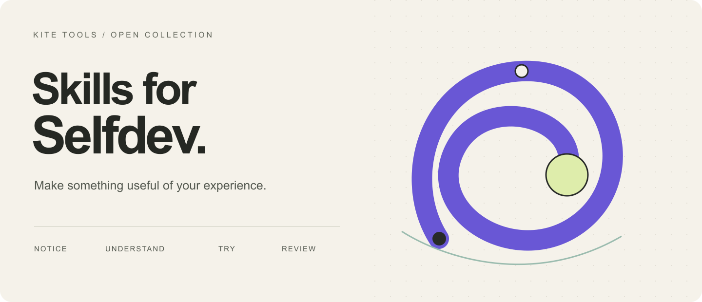
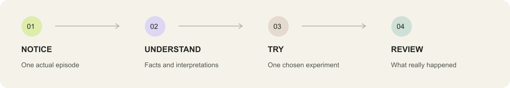

# Skills for Selfdev

**Using Claude Code?** [Build your daily assistant: copyable prompt and component map](docs/guides/daily-assistant-claude-code.md).

**AI skills for self-development. Turn experience into understanding, and understanding into a next step you choose.**

[Русский](README.ru.md) · [Start here](docs/getting-started.md) · [All skills](docs/catalog.md) · [Privacy](PRIVACY.md)



You finish a conversation, close a lecture, or reach the end of a busy day. There is something worth keeping—but it is scattered across a transcript, a few notes, and your memory.

This collection gives your AI assistant a repeatable way to work with that material: preserve what happened, explore what it might mean, and help you choose what to try. Each skill includes instructions; some also include templates, scripts, or a local runtime.

**Start small:** bring one transcript or a short account of your day. You do not need to build a personal knowledge system first.

## One practice or a personal system

| Try one practice | Build your personal assistant |
| --- | --- |
| Bring a transcript, notes or one episode. Choose a result from the catalog below. | Start with your own context and focus. Add useful practices and, optionally, a daily rhythm. |
| [Choose a skill](docs/catalog.md) | [Explore the system map](docs/system-map.md) |

[](docs/system-map.md)

For example: reflect on a consultation → keep an accepted understanding → choose an action → review the outcome at the end of the week. Evening Ten offers further possibilities; the daily assistant supports the journal and schedule. Each module also works on its own.

## Find your starting point

| I want to… | Start with | What I get |
| --- | --- | --- |
| Understand a recurring reaction | [Disco Mirror](docs/skills/disco-mirror.md) | An episode-grounded portrait of competing inner voices and an experiment to try |
| Keep the useful parts of a session | [Session reflection](docs/skills/reflect-on-session.md) | A source-linked summary, context updates, and optional visual reminders |
| See possibilities hidden in my day | [Evening Ten](docs/skills/evening-ten.md) | Ten distinct, evidence-led possibilities—not another compulsory task list |
| Learn from a lecture or masterclass | [Learning notes](docs/skills/learning-notes.md) | Readable notes that keep the source's argument, examples, and uncertainties |
| Repair a messy transcript | [Transcript cleanup](docs/skills/clean-transcript.md) | A readable transcript with terminology and speaker uncertainty handled carefully |
| Understand an expert's argument | [Expert interview analysis](docs/skills/analyze-expert-interview.md) | A visual report of structure, reasoning, quotes, and practical improvements |
| Edit a diagram trapped in a scan | [SVG reconstruction](docs/skills/reconstruct-svg.md) | An editable diagram checked against the original |
| Configure an assistant around my focus | [Personal Codex Assistant](docs/skills/personal-codex-assistant.md) | Clean personal context, working agreements and evidence of results |
| Explore one reaction | [GoR reflection](docs/skills/reflect-on-reaction.md) | Episode exploration, examined understanding and a choice of my own |
| Understand the actual day | [Cross-device day review](docs/skills/cross-device-day-review.md) | Union intervals, separate agent time and explicit gaps |
| Make sense of the week | [Weekly Review](docs/skills/weekly-review.md) | Intentions, experience and results with explicit gaps |
| Build a gentle daily rhythm | [Personal daily assistant](docs/skills/personal-daily-assistant.md) | An opt-in local Telegram assistant with a private journal and retrospectives |
| Put life events in order | [Life events](docs/skills/life-events.md) | A reviewable timeline from manual notes or a transcript |
| Explore a conditional life model | [Longevity intake](docs/skills/longevity-intake.md) | A structured, consent-aware handoff to the existing Longevity app |

## Try one skill

Clone the repository, then copy only the skill you want into your agent's skill directory:

```sh
git clone https://github.com/KiteTools/skills-for-selfdev.git
cd skills-for-selfdev
python3 scripts/install.py learning-notes
```

The installer copies files to `~/.agents/skills/`. It does **not** start a bot, connect an account, schedule messages, or upload your documents. It refuses to replace an existing installation.

In Codex, try:

```text
Use $learning-notes with this transcript. Keep the speaker's examples,
mark unclear passages, and write the result in my language.
```

For another agent, use its supported skill location or give it the selected `SKILL.md`. Tool-dependent steps still require the tools named by that skill. [Installation options and requirements →](docs/getting-started.md)

## From an episode to a next step



**Notice.** Begin with an actual episode, source, or observation. **Understand.** Keep facts, reported experiences, and interpretations separate. **Try.** Choose an action that fits what you understood. **Review.** Look for an observable result, including a result that disproves the original idea.

The workflows grew out of personal learning and IMT practice. Method-specific ideas are named where they matter; they are not presented as universal scientific findings. The skills support reflection and preparation for a human conversation. They do not establish diagnoses, medical causality, or a person's hidden motives.

## What is included—and what connects separately

- **Portable workflows:** eleven skills run from supplied material with an AI assistant and the tools each task needs. The expert-analysis workflow includes Python helpers; SVG and image outputs need a rendering tool.
- **A local runtime:** Personal Daily Assistant includes an installable OpenClaw/Telegram package. Its bundled snapshot is documented; account setup and live verification happen on your own machine.
- **An external app workflow:** Longevity Intake connects to [Longevity](https://github.com/KiteTools/longevity-webmcp); the application is maintained in its own repository.
- **Separate applications:** [Building Your Life Function](https://github.com/KiteTools/soov) provides a local life-event timeline; [Personal Cabinet](https://github.com/KiteTools/selfdev-cabinet) provides application source and setup for your own accounts. Their [integration guides](docs/integrations/lk-sendpulse.md) explain the dependencies; hosted services are not bundled here.

Prism is an external writing tool. It is not packaged or reimplemented in this collection.

For the Personal Cabinet's everyday workflow, read the [complete user guide](docs/guides/lk-guide.md); to deploy it, use the separate [operator installation guide](https://github.com/KiteTools/selfdev-cabinet/blob/main/docs/operator-install.md) and [SendPulse setup kit](https://github.com/KiteTools/selfdev-cabinet/blob/main/docs/sendpulse-setup.md). The [portability plan](docs/integrations/portable-apps.md) distinguishes the implemented source packages from future delivery queues, adapters, and migration work. Live setup on your own accounts still needs verification. All visitor guides and skill descriptions are also available in [Russian](README.ru.md).

## Private by design of the package

This repository contains workflow instructions, original illustrations, empty templates, and clearly fictional examples. It contains no personal diaries, client sessions, family histories, account tokens, or private activity exports.

Your chosen AI provider and connected services still have their own data policies. Installing a skill does not make a cloud assistant local. [Read the data boundaries →](PRIVACY.md)

## About this release

**Version 0.2.0 — connected practices and a personal assistant.** Instructions and bundled helpers are available now. Tests check the invariants they can check; they do not certify every model, operating system, or live integration. [Validation and limits](docs/validation.md) · [Contributing](CONTRIBUTING.md) · [MIT license](LICENSE)

Built by [KiteTools](https://github.com/KiteTools). Explore the wider collection of [IMT tools and artifacts](https://app.imt.dev/artifacts/).

[What changed and how to update](docs/release-0.2.md)
