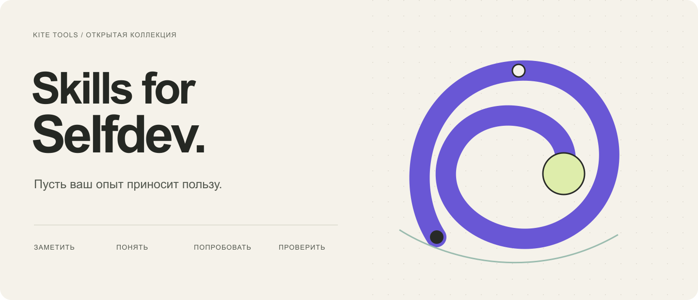
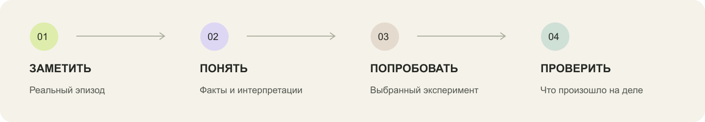

# Skills for Selfdev — скиллы для саморазвития

**Для Claude Code:** [собери ежедневного помощника — готовый промпт и карта компонентов](docs/guides/daily-assistant-claude-code.ru.md).

**Превратить опыт в понимание, а понимание — в выбранный тобой следующий шаг.**

[English](README.md) · [Русский](README.ru.md) · [Установка](docs/getting-started.ru.md) · [Каталог](docs/catalog.ru.md) · [Данные и приватность](PRIVACY.ru.md)



После разговора, лекции или насыщенного дня остаётся что-то важное. Но оно разбросано по транскрипту, заметкам и памяти. Эти скиллы помогают собрать материал, разобраться в нём и решить, что с ним делать дальше.

Это открытая коллекция инструкций для AI-ассистента. В отдельных скиллах есть шаблоны, скрипты и локальная программа. Начать можно с одного текста — без предварительной сборки сложной системы.

## Одна практика или личная система

| Попробовать одну практику | Собрать личного ассистента |
| --- | --- |
| Принеси транскрипт, заметки или один эпизод. Выбери нужный результат в каталоге ниже. | Начни с собственного контекста и фокуса. Затем добавь подходящие практики и, при желании, ежедневный ритм. |
| [Выбрать скилл](docs/catalog.ru.md) | [Открыть карту системы](docs/system-map.ru.md) |

[](docs/system-map.ru.md)

Например: разобрать консультацию → сохранить принятое понимание → выбрать действие → проверить результат на недельном ретро. Десятка предлагает дополнительные возможности; ежедневный помощник поддерживает журнал и расписание. Каждый модуль можно использовать отдельно.

## Выбери свою задачу

| Задача | Скилл | Результат |
| --- | --- | --- |
| Разобраться в привычной реакции | [Disco Mirror](docs/skills/disco-mirror.ru.md) | Рабочий портрет внутренних голосов по конкретным эпизодам и опыт для проверки |
| Сохранить понимания после консультации | [Разбор своей сессии](docs/skills/reflect-on-session.ru.md) | Саммари, обновления личного контекста, при желании схемы и плакаты |
| Увидеть возможности в прожитом дне | [Вечерняя десятка](docs/skills/evening-ten.ru.md) | Десять разных ходов с опорой на события дня, без обязательства их выполнять |
| Изучить лекцию или мастер-класс | [Учебный конспект](docs/skills/learning-notes.ru.md) | Связные объяснения, примеры, источники и сохранённые неясности |
| Привести расшифровку в порядок | [Очистка транскрипта](docs/skills/clean-transcript.ru.md) | Читаемая речь с аккуратной правкой терминов |
| Разобрать выступление эксперта | [Анализ интервью](docs/skills/analyze-expert-interview.ru.md) | Отчёт о структуре и логике с цитатами и рекомендациями |
| Сделать рисунок редактируемым | [Восстановление SVG](docs/skills/reconstruct-svg.ru.md) | Векторная схема, сверенная с оригиналом |
| Настроить помощника под свой фокус | [Ассистент в Codex](docs/skills/personal-codex-assistant.ru.md) | Чистый личный контекст, правила работы и фиксация подтверждённых результатов |
| Разобрать конкретную реакцию | [GoR-разбор](docs/skills/reflect-on-reaction.ru.md) | Исследование эпизода, проверка понимания и собственное решение |
| Собрать факты прожитого дня | [Анализ дня по всем девайсам](docs/skills/cross-device-day-review.ru.md) | Объединённые интервалы, отдельное время агентов и явные пробелы |
| Осмыслить неделю | [Недельное ретро](docs/skills/weekly-review.ru.md) | Связь намерений, опыта и результатов с явными пробелами |
| Настроить личный ежедневный ритм | [Личный помощник](docs/skills/personal-daily-assistant.ru.md) | Telegram-диалог через OpenClaw, локальный журнал и ретро |
| Собрать события жизни | [Лента событий](docs/skills/life-events.ru.md) | Проверяемая хронология из записей или транскрипта |
| Исследовать условную модель жизни | [Longevity](docs/skills/longevity-intake.ru.md) | Подготовленные данные и взаимодействие с отдельным приложением |

## Быстрый запуск

```sh
git clone https://github.com/KiteTools/skills-for-selfdev.git
cd skills-for-selfdev
python3 scripts/install.py evening-ten
```

Затем в Codex:

```text
Используй $evening-ten. Вот мои заметки о сегодняшнем дне.
Покажи возможности, которые следуют из этих событий.
Не превращай предложения в обязательные задачи.
```

Установщик только копирует выбранный скилл в `~/.agents/skills/`. Подключение Telegram, расписаний и внешних сервисов выполняется отдельно. Для большинства сценариев достаточно передать свой материал; история компьютера нужна только если ты выбираешь её источником.

## Как это связано



Факт, предположение и принятое человеком решение сохраняются раздельно. Консультация может дать новое понимание; устойчивое изменение проверяется по последующим действиям и результатам. Отсутствие подтверждения — допустимый результат разбора.

Часть процессов выросла из практики ИМТ. Там, где используется конкретная методическая модель, она названа прямо. AI помогает работать с материалом и готовиться к живому разговору; авторство выбора остаётся у человека.

[Личный кабинет и SendPulse](docs/integrations/lk-sendpulse.ru.md) входят в карту selfdev как отдельная интеграция; [исходники приложения](https://github.com/KiteTools/selfdev-cabinet) предназначены для установки со своими аккаунтами. [Построение своей жизненной функции](https://github.com/KiteTools/soov) — отдельная локальная лента событий с ручным вводом и проверяемым импортом из транскрипта; она продолжает идею экрана, предшествовавшего Longevity. Prism остаётся внешним инструментом: его реализация в репозиторий не входит.

В публичных файлах нет личных дневников, консультаций и семейных историй автора. Примеры вымышлены. Используемый AI-сервис при этом может обрабатывать переданный ему текст: [границы приватности](PRIVACY.ru.md).

## Личный кабинет и самостоятельная установка

[Полный гид Личного кабинета](docs/guides/lk-guide.ru.md) описывает все семь вкладок, сценарии работы и обмен данными с ботом. Для своей установки есть [инструкция оператора](https://github.com/KiteTools/selfdev-cabinet/blob/main/docs/operator-install.ru.md) и [комплект настройки SendPulse](https://github.com/KiteTools/selfdev-cabinet/blob/main/docs/sendpulse-setup.ru.md). [План отчуждаемости](docs/integrations/portable-apps.ru.md) отделяет реализованные пакеты исходников от будущих очередей доставки, адаптеров и переноса данных. Живое развёртывание на своих аккаунтах нужно проверить отдельно.

Все страницы описаний, каталог, инструкции и примеры результатов доступны на русском. Переключатель English / Русский находится в начале каждой пары страниц. Технические инструкции скиллов и исходные файлы учебных примеров сохраняют исходный язык.

Версия **0.2.0**. [Что проверено и что требует проверки у тебя](docs/validation.ru.md). [Лицензия MIT](LICENSE).

[Что изменилось и как обновиться](docs/release-0.2.ru.md)
