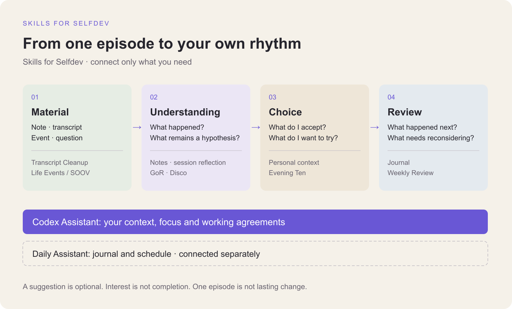
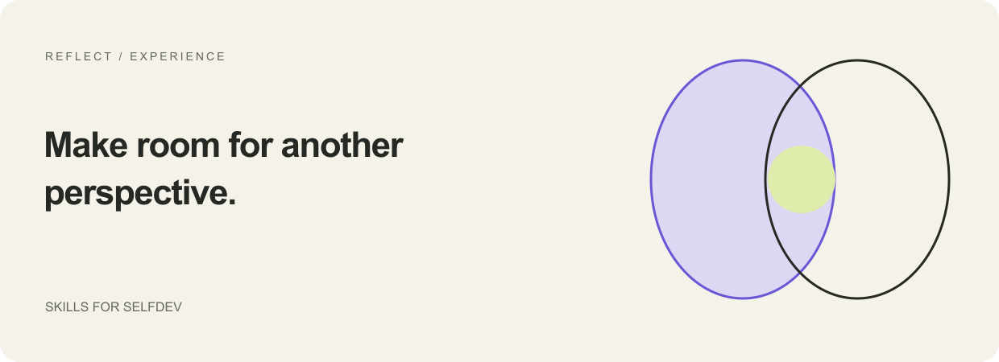
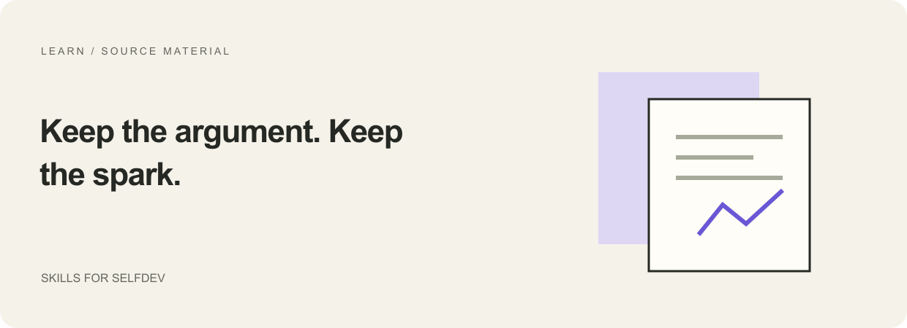
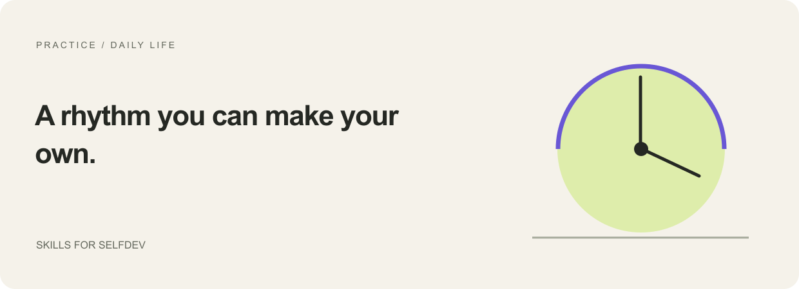
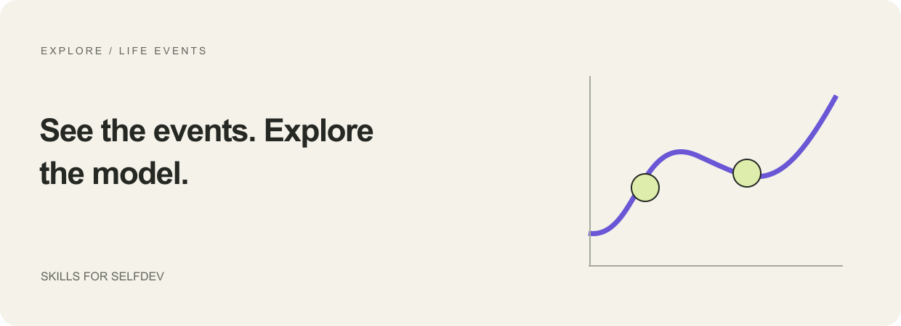

# AI skills for self-development

[English](catalog.md) · [Русский](catalog.ru.md)

Thirteen focused workflows for reflection, learning, journaling, and working with life events. Choose by the result you want. Each page explains what to provide, what comes back, and which tools it needs.

## First, choose the scope

**One practice:** choose a result below and bring your material. **A personal system:** start with the [system map](system-map.md), which shows how one skill's output becomes a reviewed input for the next.

For ongoing work, [Personal Codex Assistant](skills/personal-codex-assistant.md) sets up your context, focus and rules for recording results. [Personal Daily Assistant](skills/personal-daily-assistant.md) adds a separately configured journal and Telegram rhythm. Both begin with clean templates.

## Reflect on experience

| Skill | Bring | Take away |
| --- | --- | --- |
| [Disco Mirror](skills/disco-mirror.md) | Recent concrete episodes and your own answers | A working portrait of inner voices, counterexamples, and a small experiment |
| [Session reflection](skills/reflect-on-session.md) | Your consultation transcript; optional existing context | Source-linked understanding, adoption status, chosen actions, optional visuals |
| [GoR reaction reflection](skills/reflect-on-reaction.md) | One concrete episode and your answers | Examined understanding, a voluntary decision and a corresponding action |
| [Weekly Review](skills/weekly-review.md) | Selected weekly notes, intentions and outcome evidence | Experience, patterns and gaps; chosen adjustments for the next week |
| [Evening Ten](skills/evening-ten.md) | A day summary, current goals, and optional previous suggestions | Ten varied possibilities grounded in the day; a partial set if evidence is insufficient |

These are on-demand skills. No computer monitoring, profile storage, or scheduled messaging is enabled by installing them.

## Learn from your material

| Skill | Bring | Take away |
| --- | --- | --- |
| [Learning notes](skills/learning-notes.md) | A lecture, class, or masterclass transcript | A readable explanation with examples and traceable source support |
| [Transcript cleanup](skills/clean-transcript.md) | Raw transcript; optional glossary and speaker map | Cleaned speech with uncertain words and identities left visible |
| [Expert interview analysis](skills/analyze-expert-interview.md) | A timed, speaker-labelled host/guest transcript | An offline HTML report on the guest's structure and reasoning |
| [SVG reconstruction](skills/reconstruct-svg.md) | A diagram image or PDF page | An editable SVG and a visual comparison with the source |

The interview skill includes deterministic helpers. Notes and transcript cleanup depend on careful source reading; they do not claim automatic factual correctness.

## Build a personal rhythm

[Personal Daily Assistant](skills/personal-daily-assistant.md) is the larger package: an opt-in OpenClaw/Telegram runtime with a journal, morning and evening dialogue, and weekly review. It needs a private workspace and your own service setup. The bundled dialogue is primarily Russian.

[Personal Cabinet + SendPulse](integrations/lk-sendpulse.md) explains the workflow and links to the [standalone application and installation tools](https://github.com/KiteTools/selfdev-cabinet). [Building Your Life Function](https://github.com/KiteTools/soov) is a separate local event app. Hosted services and accounts are not part of this skills repository.

## Explore events and models

[Life Events](skills/life-events.md) organizes manually entered events or extracts them from a supplied transcript, preserving dates, uncertainty, and sources. It is a portable companion inspired by the earlier [SOOV / СООВ workflow](integrations/soov.md), not a bundled copy of that application.

[Longevity Intake](skills/longevity-intake.md) prepares structured input for the separate [Longevity app](https://app.imt.dev/longevity-mcp/). Its scenarios are conditional on a stated model; they are not medical predictions.

## Which skills work without extra accounts?

Disco Mirror, Session Reflection, Evening Ten, Learning Notes, Transcript Cleanup, Life Events, and SVG Reconstruction can start with supplied files and your existing AI assistant. Rendering or image-generation tools may be needed for visual output. Expert Interview Analysis adds local Python helpers. Personal Daily Assistant and Longevity have the additional dependencies listed on their pages.

## What does “skills for selfdev” mean here?

A skill is a reusable set of instructions that changes how an AI assistant approaches a task. Selfdev means self-development through learning, reflection, and chosen practice. This collection combines the two: it helps work with real material instead of generating generic motivational advice.

The collection includes a portable plugin manifest and standalone skill folders. It is not a cloud service, a promise of personal transformation, or an official marketplace listing.

[Get started](getting-started.md) · [Privacy](../PRIVACY.md) · [Русский](../README.ru.md) · [Back to the collection](../README.md)
