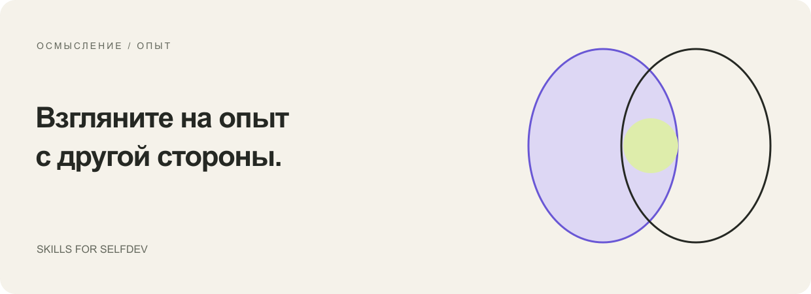
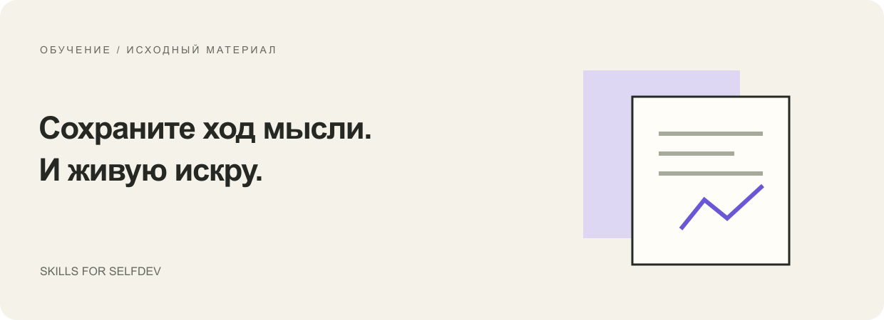
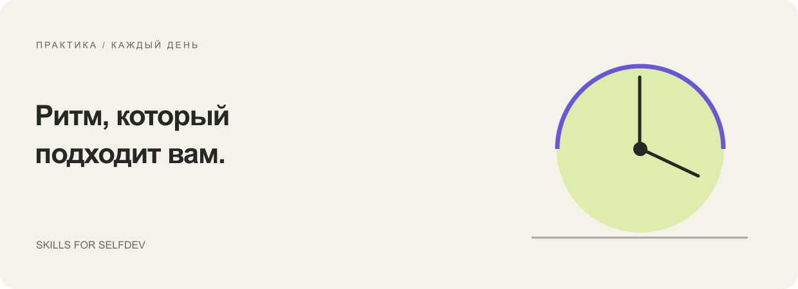
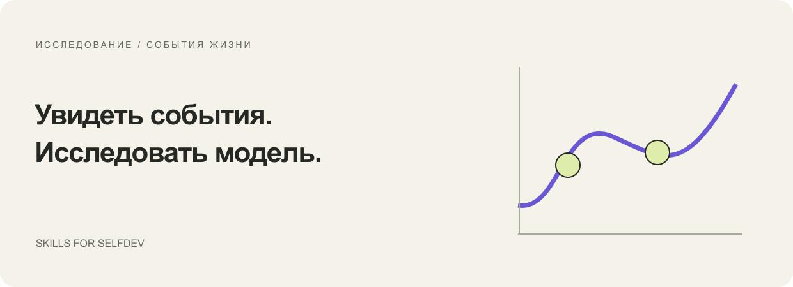

# AI-скиллы для саморазвития

[English](catalog.md) · [Русский](catalog.ru.md)

Десять отдельных процессов для рефлексии, учёбы, дневника и работы с событиями жизни. Выбирай по нужному результату. На каждой странице описано, что передать, что получится и какие инструменты потребуются.

## Разобраться в своём опыте

| Скилл | Что передать | Что получить |
| --- | --- | --- |
| [Disco Mirror](skills/disco-mirror.ru.md) | Недавние конкретные эпизоды и собственные ответы | Рабочий портрет внутренних голосов, контрпримеры и небольшой опыт для проверки |
| [Разбор своей сессии](skills/reflect-on-session.ru.md) | Транскрипт своей консультации; при наличии — текущий личный контекст | Понимания со ссылками на источник, статус их принятия, выбранные действия и, при желании, визуальные материалы |
| [Вечерняя десятка](skills/evening-ten.ru.md) | Итоги дня, актуальные цели и, при наличии, предыдущие предложения | Десять разных возможностей с опорой на день; неполный набор, если материала недостаточно |

Эти скиллы запускаются по запросу. Их установка не включает наблюдение за компьютером, хранение профиля или отправку сообщений по расписанию.

## Учиться на своём материале

| Скилл | Что передать | Что получить |
| --- | --- | --- |
| [Учебный конспект](skills/learning-notes.ru.md) | Транскрипт лекции, занятия или мастер-класса | Связное объяснение с примерами и проверяемыми опорами в источнике |
| [Очистка транскрипта](skills/clean-transcript.ru.md) | Сырую расшифровку; при наличии — словарь и список говорящих | Читаемую речь с сохранёнными неясными словами и неопределённостью в том, кто говорит |
| [Анализ интервью эксперта](skills/analyze-expert-interview.ru.md) | Транскрипт с таймкодами и обозначенными ролями ведущего и гостя | HTML-отчёт о структуре и логике речи гостя, доступный без сети |
| [Восстановление SVG](skills/reconstruct-svg.ru.md) | Изображение схемы или страницу PDF | Редактируемый SVG и визуальное сравнение с оригиналом |

Скилл анализа интервью включает вспомогательные скрипты с определёнными правилами обработки. Конспектирование и очистка транскрипта зависят от внимательного чтения источника; автоматическая фактическая безошибочность не заявляется.

## Выстроить личный ритм

[Личный ежедневный помощник](skills/personal-daily-assistant.ru.md) — более крупный пакет: отдельно подключаемая программа для OpenClaw/Telegram с журналом, утренним и вечерним диалогом и недельным ретро. Ему нужны частная рабочая папка и твоя собственная настройка сервисов. Встроенный диалог преимущественно на русском языке.

[ЛК + SendPulse](integrations/lk-sendpulse.ru.md) — отдельное руководство по интеграции с существующим личным кабинетом и ботом. Работающее приложение и аккаунты в этот репозиторий не входят.

## Исследовать события и модели

[Лента событий](skills/life-events.ru.md) упорядочивает события, введённые вручную, или извлекает их из предоставленного транскрипта, сохраняя даты, неопределённости и источники. Это переносимый вспомогательный процесс, вдохновлённый более ранним [СООВ / SOOV](integrations/soov.ru.md), а не включённая в пакет копия того приложения.

[Подготовка данных для Longevity](skills/longevity-intake.ru.md) помогает собрать структурированный ввод для отдельного [приложения Longevity](https://app.imt.dev/longevity-mcp/). Его сценарии условны и зависят от заданной модели; это не медицинские прогнозы.

## Какие скиллы работают без дополнительных аккаунтов?

Disco Mirror, разбор своей сессии, вечерняя десятка, учебный конспект, очистка транскрипта, лента событий и восстановление SVG могут начать работу с предоставленных файлов в твоём существующем AI-ассистенте. Для визуальных результатов могут понадобиться инструменты отрисовки или генерации изображений. Анализ интервью эксперта добавляет локальные Python-скрипты. У личного помощника и Longevity есть дополнительные зависимости, перечисленные на их страницах.

## Что здесь означает «skills for selfdev»?

Скилл — это повторно используемый набор инструкций, который меняет подход AI-ассистента к задаче. Selfdev означает саморазвитие через учёбу, рефлексию и выбранную практику. Коллекция соединяет эти две вещи: помогает работать с реальным материалом, вместо того чтобы выдавать общие мотивационные советы.

В коллекции есть переносимый манифест плагина и самостоятельные папки скиллов. Это не облачный сервис, не обещание личностной трансформации и не официальная публикация в магазине плагинов.

[Начать работу](getting-started.ru.md) · [Приватность](../PRIVACY.ru.md) · [На главную](../README.ru.md)
