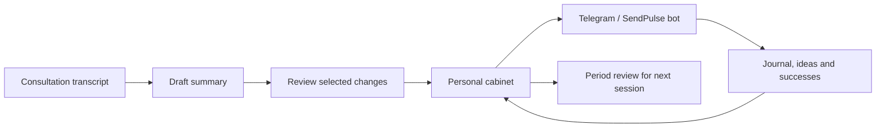

# Personal cabinet + SendPulse: carry a consultation into daily life

[English](lk-sendpulse.md) · [Русский](lk-sendpulse.ru.md)

The Personal Cabinet (Личный кабинет) connects consultation notes, daily journals and a Telegram bot. Its purpose is to keep the ideas a person reviewed with their consultant available during the period between sessions.

This collection keeps the integration overview and user guide. The application source is a separate distribution: **[KiteTools/selfdev-cabinet](https://github.com/KiteTools/selfdev-cabinet)**. It supplies the application and setup tools; it does not supply hosted accounts or a verified live deployment.

**Read the [complete cabinet guide](../guides/lk-guide.md)** for all seven tabs, everyday scenarios, data flows and troubleshooting. It is published from the existing application's guide; it does not grant service access.

## The working loop

In the cabinet, **Summary** turns a transcript and optional notes into a structured draft. **Apply** previews which groups of fields will be overwritten; the person chooses what to update. Questions, quotes, affirmations and the current working pattern can then shape the bot's subsequent messages.

The cabinet also provides a journal, an analysis history, a registry of working patterns and a period review. Automatic activity signals and confirmed progress are separate: a new journal entry does not itself prove a pattern changed.

## Before you use it

You need access to a configured cabinet deployment and its Telegram bot. In SendPulse mode start that bot with `/start`, open its contact-aware application link, and complete Telegram login. The server verifies that your signed Telegram identity belongs to that SendPulse bot contact before reading its variables or creating a session. Local transport also requires Telegram login but does not require SendPulse. Installing these skills does not grant an account or access to someone else's cabinet.

The service operator must provision the application, storage, Telegram/SendPulse integration, AI processing and any email delivery used by the deployment. Credentials belong in the service's private configuration. This collection supplies none of those accounts, tokens or operational services.

## A careful first session

1. Upload a transcript in a supported format (`.txt`, `.md` or `.vtt`), with optional notes.
2. Generate the summary and review it against the source. The existing application sends this material to its configured AI API for processing; this is not an in-tab-only workflow like Longevity.
3. Inspect **Apply** and choose the exact groups to update. Confirm only after checking the proposed replacements and current working pattern.
4. Read back the saved fields. Verify bot delivery separately before claiming that the new material reached it.
5. Before the next consultation, review the period together with the original journal entries and successes.

**Example request to an assistant with authorized access:**

> Help me check this consultation summary before I apply it to my cabinet. Show the source for each proposed change and identify which bot fields would be replaced.

## Privacy and scope

Unlike this public skills repository, the cabinet stores personal records and connects external services. Use your own deployment or the service account your operator provides. Verify its retention, sharing and access settings before uploading a transcript. Do not publish real examples, contact identifiers, screenshots of private records or credentials in issues and pull requests.

The guide describes the reviewed workflow; access and actual behavior depend on the configured deployment. The separate source distribution does not grant access to an existing service or assume an agent has SendPulse credentials. For a standalone local assistant package, see [Personal Daily Assistant](../skills/personal-daily-assistant.md).

## Install your own Personal Cabinet

The [standalone repository](https://github.com/KiteTools/selfdev-cabinet) packages a clean static client and Netlify Functions, Neon/PostgreSQL migrations, Telegram login, optional OpenAI processing, and optional SMTP email. Use the **[operator installation guide](https://github.com/KiteTools/selfdev-cabinet/blob/main/docs/operator-install.md)** and **[SendPulse setup kit](https://github.com/KiteTools/selfdev-cabinet/blob/main/docs/sendpulse-setup.md)** with your own accounts and an empty database.

The implementation includes environment setup/checking, migration planning and explicit application, a restricted static build, and a transport facade with `sendpulse` and `local` adapters. `local` saves in the application database and explicitly does not deliver to a bot. SendPulse mode requires the operator's client credentials and bot ID. The public login checks contact ownership; SMTP copies are opt-in, and the application does not push starter content to a contact merely because someone logged in.

The setup kit documents exact variables, inbound endpoints, authentication headers, fictional payloads, and manual flow reconstruction. It contains no private bot export. The operator still configures schedules, voice transcription, AI-agent instructions, and the flow's error branches in SendPulse.

**Delivery status:** source and setup documentation are implemented; deployment and the full loop on a new operator's accounts have not been live-verified. An outgoing queue, delivery acknowledgments, universal deduplication, a direct Telegram transport, and migration of an existing account's complete data are not implemented. Review the [portability design](portable-apps.md#lk) for those later milestones and run the installation guide's acceptance walkthrough before inviting users.

[Catalog](../catalog.md) · [Skills for Selfdev](../../README.md)
