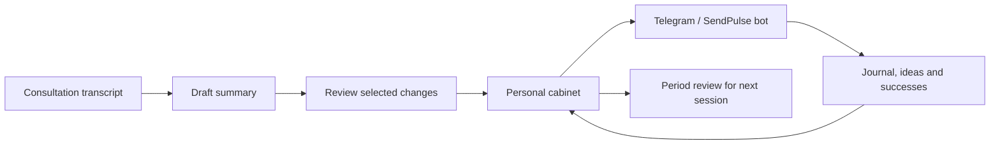

# Personal cabinet + SendPulse: carry a consultation into daily life

The IMT personal cabinet (**ЛК**) connects consultation notes, daily journals and a Telegram bot. Its purpose is to keep the ideas a person reviewed with their consultant available during the period between sessions.

This is an **integration guide for an existing application**, not a bundled application or a working connector supplied by this repository.

## The working loop

In the cabinet, **Summary** turns a transcript and optional notes into a structured draft. **Apply** previews which groups of fields will be overwritten; the person chooses what to update. Questions, quotes, affirmations and the current working pattern can then shape the bot's subsequent messages.

The cabinet also provides a journal, an analysis history, a registry of working patterns and a period review. Automatic activity signals and confirmed progress are separate: a new journal entry does not itself prove a pattern changed.

## Before you use it

You need access to a configured cabinet deployment and its Telegram bot. Start that bot with `/start` so your identity can be linked to your records, then open the cabinet and complete its Telegram Login Widget flow. Installing these skills does not grant an account or access to someone else's cabinet.

The service operator must provision the application, storage, Telegram/SendPulse integration, AI processing and any email delivery used by the deployment. Credentials belong in the service's private configuration. This collection supplies none of those accounts, tokens or operational services.

## A careful first session

1. Upload a transcript in a supported format (`.txt`, `.md` or `.vtt`), with optional notes.
2. Generate the summary and review it against the source. The existing application sends this material to its configured AI API for processing; this is not an in-tab-only workflow like Longevity.
3. Inspect **Apply** and choose the exact groups to update. Confirm only after checking the proposed replacements and current working pattern.
4. Read back the saved fields. Verify bot delivery separately before claiming that the new material reached it.
5. Before the next consultation, review the period together with the original journal entries and successes.

**Example request to an assistant with authorized access:**

> Help me check this consultation summary before I apply it to my cabinet. Show the source for each proposed change and identify which bot fields would be replaced.

## Privacy and scope

Unlike this public skills repository, the cabinet stores personal records and connects external services. Use your own deployment or the service account your operator provides. Verify its retention, sharing and access settings before uploading a transcript. Do not publish real examples, contact identifiers, screenshots of private records or credentials in issues and pull requests.

The guide describes the reviewed cabinet workflow. It does not redistribute the app, promise a public signup route, or assume an agent has SendPulse access. For a standalone local assistant package, see [Personal Daily Assistant](../skills/personal-daily-assistant.md).
