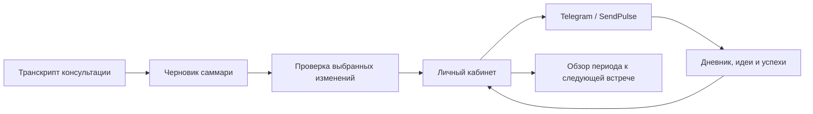

# Личный кабинет и SendPulse: от консультации к ежедневной практике

[English](lk-sendpulse.md) · [Русский](lk-sendpulse.ru.md)

Личный кабинет ИМТ (**ЛК**) соединяет материалы консультаций, дневники и Telegram-бота. Он помогает сохранять в поле внимания понимания, разобранные с консультантом, в период между встречами.

Это **описание интеграции с существующим приложением**. Само приложение и работающий коннектор в этот репозиторий не входят.

**[Полный гид по личному кабинету](../guides/lk-guide.ru.md)** описывает все семь вкладок, повседневные сценарии, движение данных и решение частых затруднений. Он опубликован на основе инструкции существующего приложения; публикация не предоставляет доступ к сервису.

## Рабочий цикл

Вкладка **Summary** превращает транскрипт и дополнительные заметки в структурированный черновик. **Apply** показывает, какие группы полей будут перезаписаны; человек выбирает, что обновлять. Вопросы, цитаты, аффирмации и текущая связка затем могут использоваться в следующих сообщениях бота.

Также в ЛК есть дневники, история разборов, реестр связок и ретро. Автоматические сигналы активности отделены от подтверждённого прогресса: новая запись в дневнике сама по себе не доказывает, что связка изменилась.

## Что нужно для работы

Нужен доступ к настроенному экземпляру ЛК и его Telegram-боту. Сначала отправьте боту `/start`, чтобы связать личность с записями, затем откройте кабинет и войдите через Telegram Login Widget. Установка скиллов не создаёт аккаунт и не открывает чужой кабинет.

Оператор сервиса настраивает приложение, хранилище, связку Telegram/SendPulse, обработку через AI API и почтовую отправку, если она используется. Секреты остаются в частной конфигурации. Эта коллекция не предоставляет аккаунты, токены или работающие внешние сервисы.

## Первый разбор

1. Загрузите транскрипт в поддерживаемом формате (`.txt`, `.md` или `.vtt`); при необходимости добавьте заметки.
2. Создайте саммари и сверьте его с исходником. Приложение передаёт материал настроенному AI API: это не обработка исключительно в открытой вкладке, как локальная работа с данными в Longevity.
3. Откройте **Apply**, проверьте предложенные замены и связку в фокусе, выберите точные группы для обновления.
4. Проверьте сохранённые поля. Доставку в бот проверяйте отдельно, прежде чем считать её состоявшейся.
5. Перед следующей консультацией сопоставьте обзор периода с исходными дневниковыми записями и успехами.

**Пример запроса ассистенту, которому вы предоставили доступ:**

> Помоги проверить саммари консультации перед применением в ЛК. Покажи источник каждого предложенного изменения и укажи, какие поля бота будут заменены.

## Данные и границы

В отличие от публичной коллекции скиллов, ЛК хранит личные записи и обращается к внешним сервисам. Используйте свой экземпляр приложения или доступ, предоставленный его оператором. Перед загрузкой транскрипта проверьте правила хранения, доступа и передачи данных. Реальные примеры, контактные идентификаторы, скриншоты частных записей и секреты не предназначены для публичных issues или pull requests.

Описание не распространяет исходники приложения, не обещает открытой регистрации и не предполагает, что у ассистента уже есть доступ в SendPulse. Отдельный локальный пакет помощника — [Personal Daily Assistant](../skills/personal-daily-assistant.ru.md).

## Как сделать ЛК отчуждаемым

В изученном исходнике используются статический интерфейс, Netlify Functions, Neon/Postgres, авторизация Telegram, SendPulse и AI API; дополнительная отправка писем работает через SMTP. В приложении уже есть миграции базы и пример конфигурации. Для воспроизводимого релиза ещё нужно описать сценарии на стороне бота, соответствие переменных, обратные вызовы и настройку аккаунтов: установка AI-скилла этого не делает.

Первый этап — чистый публичный репозиторий приложения, который другой оператор сможет развернуть на том же стеке со своими аккаунтами и пустой базой. Затем — отделение данных и обработки ЛК от адаптера SendPulse, чтобы можно было подключить другой транспорт без переписывания кабинета.

**Оба этапа пока являются предложением.** В [плане отчуждаемости](portable-apps.ru.md#lk) описаны состав поставки, варианты входа и конкретная проверка первого пользователя.

[Каталог](../catalog.ru.md) · [Skills for Selfdev](../../README.ru.md)
