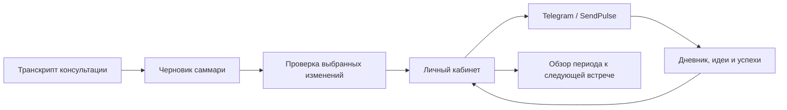

# Личный кабинет и SendPulse: от консультации к ежедневной практике

[English](lk-sendpulse.md) · [Русский](lk-sendpulse.ru.md)

Личный кабинет ИМТ соединяет материалы консультаций, дневники и Telegram-бота. Он помогает сохранять в поле внимания понимания, разобранные с консультантом, в период между встречами.

В этой коллекции остаются описание интеграции и пользовательский гид. Исходники приложения выделены в отдельную поставку: **[KiteTools/selfdev-cabinet](https://github.com/KiteTools/selfdev-cabinet)**. Она содержит приложение и инструменты настройки, но не предоставляет аккаунты внешних сервисов или проверенное живое развёртывание.

**[Полный гид по личному кабинету](../guides/lk-guide.ru.md)** описывает все семь вкладок, повседневные сценарии, движение данных и решение частых затруднений. Он опубликован на основе инструкции существующего приложения; публикация не предоставляет доступ к сервису.

## Рабочий цикл

Вкладка **Summary** превращает транскрипт и дополнительные заметки в структурированный черновик. **Apply** показывает, какие группы полей будут перезаписаны; человек выбирает, что обновлять. Вопросы, цитаты, аффирмации и текущая связка затем могут использоваться в следующих сообщениях бота.

Также в Личном кабинете есть дневники, история разборов, реестр связок и ретро. Автоматические сигналы активности отделены от подтверждённого прогресса: новая запись в дневнике сама по себе не доказывает, что связка изменилась.

## Что нужно для работы

Нужен доступ к настроенному экземпляру Личного кабинета и его Telegram-боту. В режиме SendPulse отправьте боту `/start`, откройте его ссылку на приложение с ID контакта и войдите через Telegram. До чтения переменных и создания сессии сервер проверяет, что подписанная Telegram-личность принадлежит этому контакту настроенного бота. Режим local тоже требует Telegram-входа, но обходится без SendPulse. Установка скиллов не создаёт аккаунт и не открывает чужой кабинет.

Оператор сервиса настраивает приложение, хранилище, связку Telegram/SendPulse, обработку через AI API и почтовую отправку, если она используется. Секреты остаются в частной конфигурации. Эта коллекция не предоставляет аккаунты, токены или работающие внешние сервисы.

## Первый разбор

1. Загрузите транскрипт в поддерживаемом формате (`.txt`, `.md` или `.vtt`); при необходимости добавьте заметки.
2. Создайте саммари и сверьте его с исходником. Приложение передаёт материал настроенному AI API: это не обработка исключительно в открытой вкладке, как локальная работа с данными в Longevity.
3. Откройте **Apply**, проверьте предложенные замены и связку в фокусе, выберите точные группы для обновления.
4. Проверьте сохранённые поля. Доставку в бот проверяйте отдельно, прежде чем считать её состоявшейся.
5. Перед следующей консультацией сопоставьте обзор периода с исходными дневниковыми записями и успехами.

**Пример запроса ассистенту, которому вы предоставили доступ:**

> Помоги проверить саммари консультации перед применением в Личном кабинете. Покажи источник каждого предложенного изменения и укажи, какие поля бота будут заменены.

## Данные и границы

В отличие от публичной коллекции скиллов, Личный кабинет хранит личные записи и обращается к внешним сервисам. Используйте свой экземпляр приложения или доступ, предоставленный его оператором. Перед загрузкой транскрипта проверьте правила хранения, доступа и передачи данных. Реальные примеры, контактные идентификаторы, скриншоты частных записей и секреты не предназначены для публичных issues или pull requests.

Гид описывает изученный процесс; доступ и фактическое поведение зависят от настройки развёртывания. Отдельная поставка исходников не открывает существующий сервис и не означает, что у ассистента уже есть доступ в SendPulse. Отдельный локальный пакет помощника — [Personal Daily Assistant](../skills/personal-daily-assistant.ru.md).

## Установите свой Личный кабинет

В [отдельном репозитории](https://github.com/KiteTools/selfdev-cabinet) собраны чистый статический клиент и Netlify Functions, миграции Neon/PostgreSQL, вход через Telegram, необязательные OpenAI и SMTP. Используйте **[инструкцию оператора](https://github.com/KiteTools/selfdev-cabinet/blob/main/docs/operator-install.ru.md)** и **[комплект настройки SendPulse](https://github.com/KiteTools/selfdev-cabinet/blob/main/docs/sendpulse-setup.ru.md)** со своими аккаунтами и пустой базой.

Реализованы подготовка и проверка окружения, просмотр плана и явное применение миграций, сборка с ограниченным набором публичных файлов и общий интерфейс доставки с адаптерами `sendpulse` и `local`. Режим `local` сохраняет данные в базе приложения и явно не доставляет их в бот. Для SendPulse нужны собственные реквизиты и ID бота. Публичная версия проверяет принадлежность контакта при входе; копия email включается отдельно, а стартовые тексты не отправляются контакту только из-за входа пользователя.

Комплект SendPulse описывает точные переменные, входящие endpoints, заголовки авторизации, вымышленные запросы и ручную сборку цепочек. Частного экспорта бота в нём нет. Расписания, распознавание голоса, инструкции ИИ-агента и ветки обработки ошибок оператор настраивает в SendPulse.

**Статус поставки:** исходники и инструкции реализованы; развёртывание и полный цикл на новых аккаунтах оператора ещё не проверены в живых сервисах. Очередь исходящих событий, подтверждения доставки, универсальная защита от дублей, прямой Telegram-адаптер и перенос всех данных существующего аккаунта не реализованы. Следующие этапы описаны в [плане отчуждаемости](portable-apps.ru.md#lk). Перед приглашением пользователей пройдите проверку результата из инструкции установки.

[Каталог](../catalog.ru.md) · [Skills for Selfdev](../../README.ru.md)
