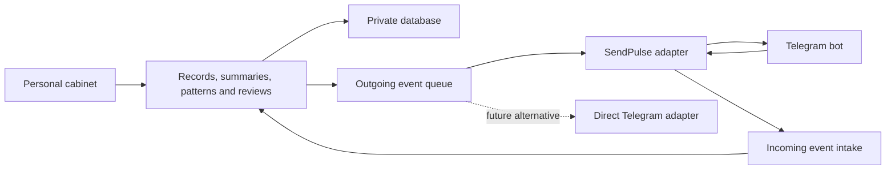

# SOOV and the personal cabinet: making the tools independently usable

[English](portable-apps.md) · [Русский](portable-apps.ru.md)

**Status: implementation proposal.** Skills and documentation, including the [complete cabinet guide](../guides/lk-guide.md), are published. The applications, adapters and installation methods proposed below are not shipped by this documentation update.

Independently usable means a concrete outcome: another person can obtain the code and instructions, run the tool with their own data and accounts, update it, back it up and continue without access to the author's infrastructure.

## What already exists

| Tool | Established foundation | Missing from the public distribution |
| --- | --- | --- |
| SOOV | According to its author: a screen for manual event entry and extraction from transcripts, preceding Longevity. This collection provides the portable [life-events](../skills/life-events.md) skill. | The original SOOV source has not yet been identified. Its storage schema, authentication and import compatibility are unconfirmed. |
| Cabinet + SendPulse | The application source and user guide were reviewed. There is a web interface, server functions, database migrations, Telegram authentication and integrations. | The app source has not been extracted into a public distribution. Full deployment on fresh accounts, including the bot flows, lacks a verified installation guide. |

## Recommended sequence

1. **Now:** publish the full guide and dependency map. This documentation milestone is complete.
2. **First standalone product:** SOOV with manual entry, reviewable import and export, without a mandatory account.
3. **First cabinet distribution:** reproducible deployment on the existing stack with the operator's own Telegram and SendPulse accounts.
4. **Next cabinet milestone:** an independent core and replaceable adapters. Add a direct Telegram bot or fully standalone mode after verifying the first distribution.

Avoid changing the backend, login system and bot at the same time. The first distribution should demonstrate that another operator can use the existing tool.

## SOOV: a local life-event timeline

Consider a fictional example: someone remembers moving at about age 24. They want to record the event, preserve the approximate age and keep their own account of the experience. A form and a file are enough for that; registration adds no immediate value.

### First release

- **Manual entry:** date or age, precision, event description, the person's own assessment and a source note.
- **From a transcript:** life-events prepares a draft in the person's chosen AI assistant; the app presents it for review before saving. Keep the full transcript only if the user separately chooses to do so.
- **Editing:** correct dates and text, delete entries and merge duplicates while preserving sources. Proposals do not become confirmed events automatically.
- **Storage:** a browser database such as IndexedDB, with explicit export and restore. Show the last export date and explain that clearing browser data can erase records.
- **Exchange:** versioned JSON for complete transfer; CSV for spreadsheet viewing, with documented limits on representing nested source records.

Proposed minimum data contract: `schema_version`, `events[]`, a stable `id`, `date` or a range/age, `date_precision`, `description`, optional `self_assessment`, `sources[]` and `review_status`. Identifiers allow repeat imports without duplicating events. This is a future format; arbitrary JSON from the current skill must not be assumed compatible with it.

### Authentication

Manual entry and local storage need no account. Cloud sync would need a separate server, login and access control in a later version. Direct API extraction is another optional feature: a server API key must not be embedded in a public page. For the first release, importing a draft prepared in the person's own assistant is enough.

Provide a separate demonstration mode with fictional events. Neither the demo nor the application build should contain real histories. Local storage does not itself encrypt the data or make an external model local.

### Distribution and acceptance

Suggested separate repository name: `soov` (not created). Include the application, format specification, local launch and static deployment instructions, a fictional example and backup instructions. Keep the skill and a clear application link in skills-for-selfdev.

First locate the original SOOV screen and check whether it can be extracted without its former server. If the source cannot be found or is too tightly coupled, build a small new client against the agreed data contract. Do not describe that as an exact copy of the original application.

**Acceptance check:** a new user adds an event without registering, imports a reviewed draft, edits it, exports JSON and restores the same records in another browser without duplicates. Longevity import must be checked separately against its own schema; compatibility is not automatic.

## The cabinet: begin with reproducible deployment

Imagine another consultant creating their own accounts, deploying an empty cabinet, starting their own bot and completing the full loop with a fictional consultation. No step requires the author's identity, database or keys. That is the first useful acceptance criterion.

### What to transfer from the existing system

| Component | Found in the source | Needed for independent installation |
| --- | --- | --- |
| Interface and API | Static client and Netlify Functions | Clean source, dependencies, build/deployment commands and an explicit list of public files |
| Storage | Neon/Postgres and numbered SQL migrations | Empty-database setup, migration order, backups, restoration and upgrades |
| Login | Telegram Login Widget / WebApp, server verification and sessions | Own bot, domain, environment variables and the `/start → login → own records` flow |
| SendPulse | API client, contacts, variables and event intake | Bidirectional field map, bot flows, callback URLs and setup order |
| AI jobs | Summaries, journals, analysis, patterns and retrospectives | Own API key, model configuration, error handling and input limits |
| Email | SMTP | Optional setup with the operator's account and clear behavior without email |

This describes the reviewed source, not a live-service test. A fresh deployment still needs verification.

### First distribution contents

Suggested separate repository name: `selfdev-cabinet` (not created).

- Application source **with a new, clean Git history**, excluding private configuration, real records and old uploads.
- An `.env.example` with empty or clearly fictional values and an explanation of every required parameter. Configure secrets on the server; keep them out of the public build.
- Database migrations and a synthetic demonstration dataset separate from working records.
- Prepare error logs: the reviewed SendPulse client currently logs part of a contact and the contents of variable-update requests. Before release, remove these values from logs, retain technical status and request identifiers, and verify this with synthetic data.
- An operator guide covering accounts, domain, login, variables, background jobs, bot setup, upgrades and recovery.
- A **SendPulse setup kit:** flow diagrams, variable types and exchange directions, callback configuration, a synthetic event and its expected result. Include a portable flow export if available and verified; otherwise provide step-by-step reconstruction. Automatic cloning has not been verified.
- The published [user guide](../guides/lk-guide.md), tied to a release version, and an end-to-end check with fictional data.

Keep Telegram login and the existing SendPulse connection in the first version. Independent deployment means **the new operator's own accounts**, not the absence of external dependencies. A cabinet without Telegram would require a different login method; that capability is not claimed today.

### Then separate SendPulse from the core

**This is proposed architecture.** The primary user identifier belongs to the cabinet; Telegram ID and SendPulse contact ID become external mappings. The core stores records. The adapter translates fields and messages into the service's format, verifies the source of incoming events and retains delivery identifiers.

Add an outgoing queue, retries and duplicate protection. Display “saved in the cabinet,” “sent to SendPulse” and “delivery confirmed” as separate states. Then consider a direct Telegram bot or manual journaling without SendPulse. Replacing the transport still requires reproducing the bot's interaction flows.

### First-distribution acceptance check

A new operator follows the instructions: empty database → own bot → `/start` and login → fictional transcript → summary → preview and apply selected fields → verify bot update → journal entry → retrospective → backup and restore.

Also check two independent test accounts: each sees only its own records; repeating one incoming event creates no duplicate; a SendPulse outage does not lose saved material. The public distribution is ready after these scenarios work in a fresh environment, not just after the code reaches GitHub.

## Method boundary

The cabinet helps organize material and support the person's chosen practice between consultations. AI does not declare a hidden cause established or choose for the client. Within IMT practice, new understanding is joined to the person's decision and a corresponding action; a sustained result is checked over time. An activity counter or a well-written summary cannot replace that check.

[SOOV overview](soov.md) · [Cabinet + SendPulse overview](lk-sendpulse.md) · [Catalog](../catalog.md)
