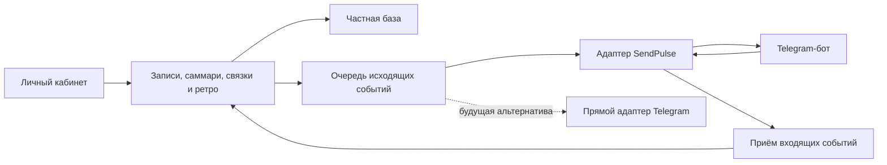

# СООВ и Личный кабинет: как сделать инструменты отчуждаемыми

[English](portable-apps.md) · [Русский](portable-apps.ru.md)

**Статус: проектное предложение с обновлением о реализации.** Документ сохраняет направление развития. Следующий раздел фиксирует то, что уже реализовано; последующие проектные разделы описывают требования, а не утверждают, что все возможности выпущены.

Отчуждаемость здесь означает простой результат: другой человек получает код и инструкцию, запускает инструмент со своими данными и аккаунтами, может обновить его, сделать резервную копию и продолжить работу без доступа к инфраструктуре автора.

## Статус текущей поставки

- **[СООВ](https://github.com/KiteTools/soov):** новое самостоятельное браузерное приложение только для событий: ручной ввод, проверяемый импорт, IndexedDB, резервная копия и восстановление JSON, экспорт CSV. Исходный экран найден в [коде Longevity](https://github.com/KiteTools/longevity-webmcp). Прежняя модель и совместимость старых файлов не включены; формат текущего выпуска задаёт его [схема](https://github.com/KiteTools/soov/blob/main/schema.json).
- **[Личный кабинет](https://github.com/KiteTools/selfdev-cabinet):** чистые исходники приложения, скрипты подготовки и проверки окружения, миграции, сборка с ограниченным набором публичных файлов, инструкция оператора и ручная сборка SendPulse. Общий интерфейс доставки поддерживает `sendpulse` и `local`; local сохраняет данные без доставки в бот. Вход через Telegram в режиме SendPulse проверяет принадлежность контакта.
- **Ещё не проверено в живых сервисах:** установка Netlify/Neon/Telegram/SendPulse новым оператором и полный цикл доставки. Пройдите [проверку установки](https://github.com/KiteTools/selfdev-cabinet/blob/main/docs/operator-install.ru.md) со своими аккаунтами.
- **Остаётся предложением:** исходящая очередь/outbox, подтверждения доставки, универсальная защита от дублей, прямой Telegram-адаптер, облачная синхронизация СООВ и полный перенос старых пользовательских данных. Общий интерфейс с двумя адаптерами не реализует всю эту архитектуру.

## Что уже есть

| Инструмент | Подтверждённая опора | Чего ещё нет в публичной поставке |
| --- | --- | --- |
| СООВ | Исходный экран найден в Longevity; отдельное небольшое приложение и [life-events](../skills/life-events.ru.md) доступны отдельными пакетами исходников. | Облачная синхронизация, встроенный ИИ-сервис и конвертер старых файлов модели. |
| Личный кабинет + SendPulse | Отдельная поставка исходников, подготовка окружения и миграций, инструкция оператора, общий интерфейс доставки и ручная сборка бота. | Проверка на новых аккаунтах, переносимый экспорт частного бота, исходящая очередь и полный перенос данных. |

## Порядок развития

1. **Документация:** опубликовать полный гид и карту зависимостей. Этот этап выполнен.
2. **Первый самостоятельный продукт:** СООВ с ручным вводом, проверяемым импортом и экспортом, без обязательного аккаунта.
3. **Первая поставка Личного кабинета:** воспроизводимое развёртывание на существующем стеке со своими Telegram и SendPulse.
4. **Следующий этап Личного кабинета:** независимое ядро и заменяемые адаптеры. Прямой Telegram-бот или полностью самостоятельный режим — после проверки первой поставки.

Не нужно одновременно переписывать сервер, систему входа и бота. Первая поставка должна доказать, что существующим инструментом может воспользоваться другой владелец.

## СООВ: локальная лента событий

Представим вымышленный пример: человек вспоминает переезд примерно в 24 года. Он хочет добавить событие, сохранить приблизительность возраста и собственные слова о переживании. Для этого ему достаточно формы и файла; регистрация пока ничего не добавляет.

### Исходные требования к первому выпуску

- **Ввод вручную:** дата или возраст, степень точности, описание события, собственная оценка человека, заметка об источнике.
- **Из транскрипта:** life-events подготавливает черновик в выбранном AI-ассистенте; приложение показывает его для проверки перед сохранением. Сам транскрипт сохраняется только по отдельному выбору пользователя.
- **Редактирование:** исправление дат и текста, удаление, объединение дублей с сохранением источников. Предположения не превращаются в подтверждённые события.
- **Хранение:** база в браузере, например IndexedDB, плюс явные экспорт и восстановление. Показать дату последней выгрузки и объяснить риск очистки браузера.
- **Обмен:** JSON с версией схемы — для полного переноса; CSV — для просмотра в таблице, с описанными ограничениями представления вложенных источников.

Предлагаемый минимальный договор данных: `schema_version`, `events[]`, устойчивый `id`, `date` или диапазон/возраст, `date_precision`, `description`, необязательный `self_assessment`, `sources[]`, `review_status`. Идентификаторы нужны для повторного импорта без размножения событий. Это проектный набросок, а не реализованная схема. Используйте схему и промпт импорта отдельного приложения; произвольный JSON из скилла нельзя считать автоматически совместимым.

### Авторизация

Для ручного ввода и локального хранения аккаунт не нужен. Для облачной синхронизации понадобится отдельный сервер, вход и разграничение доступа — это следующая версия. Прямое извлечение через API также отдельная опция: серверный ключ нельзя встраивать в публичную страницу. В первом выпуске достаточно импорта результата, подготовленного пользователем в своём ассистенте.

Нужен отдельный режим демонстрации на вымышленных событиях. Ни демо, ни сборка приложения не должны содержать реальные истории. Локальное хранение само по себе не шифрует данные и не делает внешнюю модель локальной.

### Что выпустить и как проверить

Отдельный репозиторий — [KiteTools/soov](https://github.com/KiteTools/soov). В нём есть приложение, схема, инструкции запуска и публикации, вымышленный пример и резервное копирование. В Skills for Selfdev остаются вспомогательный скилл и ссылка на приложение.

Исходный экран найден в Longevity. Выбрана небольшая новая реализация для сбора и переноса событий; это не точная копия прежнего приложения и его модели.

**Проверка готовности:** новый пользователь добавляет событие без регистрации, импортирует проверенный черновик, исправляет его, экспортирует JSON и восстанавливает те же записи в другом браузере без дублей. Импорт в Longevity проверяется отдельно по его собственной схеме; такая совместимость не предполагается автоматически.

## Личный кабинет: сначала воспроизводимая установка

Представим другого консультанта: он создаёт свои аккаунты, разворачивает пустой кабинет, запускает своего бота и проходит весь цикл на вымышленной консультации. Ни один шаг не требует идентификатора, базы или ключа автора. Это первый полезный критерий отчуждаемости.

### Что переносить из существующей системы

| Часть | Найдено в исходнике | Что подготовить для самостоятельной установки |
| --- | --- | --- |
| Интерфейс и API | Статический клиент и Netlify Functions | Чистый исходник, зависимости, команды сборки и развёртывания, перечень публичных файлов |
| Хранилище | Neon/Postgres и нумерованные SQL-миграции | Запуск на пустой базе, порядок миграций, резервная копия, восстановление и обновление |
| Вход | Telegram Login Widget / WebApp, серверная проверка, сессия | Создание своего бота, домен, переменные окружения, путь `/start → вход → свои записи` |
| SendPulse | API-клиент, контакты, переменные, приём событий | Карта полей в обе стороны, сценарии бота, URL обратных вызовов и порядок настройки |
| AI-задачи | Саммари, дневники, разборы, связки и ретро | Собственный API-ключ, настройки моделей, обработка ошибок и ограничения объёма |
| Почта | SMTP | Необязательная настройка своим аккаунтом; понятное поведение без почты |

Это описание изученного исходника, а не отчёт о проверке живого сервиса. Работоспособность нового развёртывания ещё предстоит подтвердить.

### Состав первой поставки

Отдельный репозиторий исходников — [KiteTools/selfdev-cabinet](https://github.com/KiteTools/selfdev-cabinet). Список ниже описывает состав задуманной поставки; наличие исходников и инструкций отдельно от проверки живого развёртывания.

- Исходники приложения **в новой чистой истории Git**, без частной конфигурации, реальных записей и старых загрузок.
- `.env.example` только с пустыми или явно вымышленными значениями и объяснением каждого обязательного параметра. Секреты настраиваются на сервере и не попадают в публичную сборку.
- Миграции базы и синтетический демонстрационный набор отдельно от рабочих данных.
- Не допускать частные значения контакта и переменных в журналы провайдеров. Публичный адаптер убирает прежнее журналирование контактов и тел запросов; при добавлении интеграций сохранять эту границу и проверять её на вымышленных данных.
- Руководство оператора: аккаунты, домен, вход, переменные, фоновые задачи, бот, обновление и восстановление.
- **Комплект SendPulse:** схема сценариев, список переменных с типами и направлениями обмена, настройка обратных вызовов, пример вымышленного события, ожидаемый результат. Если переносимый экспорт сценариев доступен и проверен — приложить его; иначе дать пошаговую сборку. Наличие автоматического клонирования пока не проверено.
- Уже опубликованный [пользовательский гид](../guides/lk-guide.ru.md), привязанный к версии выпуска, и проверка полного цикла на вымышленных данных.

В первой версии разумно сохранить вход через Telegram и нынешнюю связку с SendPulse. «Отчуждаемый» здесь означает **собственные аккаунты нового владельца**, а не отсутствие внешних зависимостей. Кабинет без Telegram потребует другого способа входа; сейчас такая возможность не заявляется.

### Затем отделить SendPulse от ядра

**Это предлагаемая архитектура; текущий общий интерфейс доставки не включает показанную исходящую очередь.** Основной идентификатор пользователя принадлежит Личному кабинету; Telegram ID и SendPulse contact ID становятся внешними связями. Записи хранятся в ядре. Адаптер переводит поля и сообщения в формат сервиса, проверяет источник входящих событий и сохраняет идентификаторы доставки.

Понадобятся очередь отправки, повторные попытки и защита от дублей. Статусы «сохранено в Личном кабинете», «передано в SendPulse» и «доставка подтверждена» показываются раздельно. Только после этого имеет смысл добавлять прямой Telegram-бот или ручной ввод дневника без SendPulse. Замена транспорта не устраняет работу по воспроизведению сценариев бота.

### Проверка готовности первой поставки

Новый оператор проходит по инструкции: пустая база → собственный бот → `/start` и вход → вымышленный транскрипт → саммари → просмотр и применение выбранных полей → проверка обновления бота → дневниковая запись → ретро → резервная копия и восстановление.

В текущей проверке нужно подтвердить изоляцию аккаунтов и реальный результат сохранения и доставки. Отсутствие дублей при повторе и надёжная повторная отправка после сбоя SendPulse остаются целями следующего этапа: текущие входящие маршруты не обещают идемпотентность, а последовательные внешние изменения могут пройти частично. Публикация кода или тест локального адаптера не закрывают эти цели.

## Граница метода

Личный кабинет помогает работать с материалом и поддерживать выбранную человеком практику между консультациями. AI не объявляет скрытую причину установленной и не принимает решение за клиента. В контексте ИМТ новое понимание соединяется с собственным решением и соответствующим действием; устойчивый результат проверяется со временем. Счётчик активности или удачное саммари не заменяют этой проверки.

[Описание СООВ](soov.ru.md) · [Описание Личного кабинета и SendPulse](lk-sendpulse.ru.md) · [Каталог](../catalog.ru.md)
