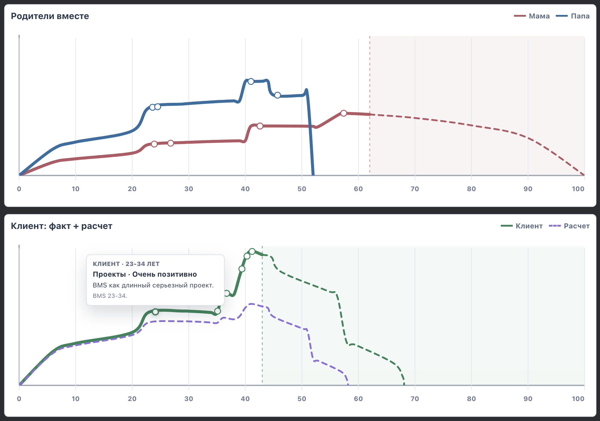

# Построение своей жизненной функции

[English](soov.md) · [Русский](soov.ru.md)

Увидеть свою жизнь целиком: в какие моменты ты развивался, какие повороты меняли её направление и какие периоды повторяются. Наглядный график помогает связать отдельные события, заметить закономерности и яснее понять, что поддерживает твоё развитие. Из этой картины легче увидеть, что ты хочешь продолжить, а что изменить.

Без внешнего анализа трудно заметить, какой путь ты уже прошёл. Что удалось создать? Когда появились новые возможности? Какие встречи, решения и перемены дали начало росту? Где повторилась знакомая история?

Жизненная функция собирает этот путь в наглядный график. На нём становятся видны подъёмы, спады, длительные периоды устойчивости и поворотные моменты. За каждой частью графика — конкретные события и результаты: семья, отношения, работа, обучение, творчество, вклад в жизнь других людей.

Ты восстанавливаешь свою историю вручную или на основе транскрипта разговора. Сопоставляешь периоды, рассматриваешь возможные связи между событиями и изменениями в жизни. При желании добавляешь истории родителей, чтобы увидеть сходства и различия: что повторяется, а где ты уже прокладываешь собственный путь.

Самая полезная часть этой работы — продолжение графика. Какое новое понимание поможет тебе изменить привычный ход событий? Какие решения и действия ему соответствуют? Что ты хочешь создать в следующем периоде своей жизни?

Прошлое даёт материал для понимания. Будущая часть остаётся открытой — её ты постепенно наполняешь своими решениями и результатами.

[Подробная страница и график](https://app.imt.dev/artifacts/life-function/)

Идея родилась при выполнении домашнего задания к семинару АФ2.8. Прежнее название — СООВ. Изображение показывает исходный прототип; построение графика пока не перенесено в отдельную открытую версию.

## Текущая открытая версия

СООВ появился до Longevity. Его исходный экран позволял вводить события жизни вручную и извлекать их из транскрипта. Этот экран найден в [исходниках Longevity](https://github.com/KiteTools/longevity-webmcp): он относится к раннему пространству событий, поверх которого позже появился режим модели.

Отдельное [приложение KiteTools/soov](https://github.com/KiteTools/soov) теперь реализует меньшую задачу: события, источники, проверку человеком, локальное хранение и перенос. Оно написано заново. В нём нет прежней модели, баллов, семейных коэффициентов, расчётов и ИИ-сервера. Старые файлы СООВ/Longevity не совместимы напрямую с новой схемой.

## Что делает приложение

- Добавляет, редактирует, удаляет и ищет события с точной или частичной датой, возрастным диапазоном либо неизвестным временем.
- Хранит собственную оценку человека отдельно от описания события, сохраняет сведения об источниках и цитаты.
- Показывает импортируемый JSON для проверки и сохраняет только явно выбранные события.
- Хранит записи в IndexedDB браузера; выгружает JSON для резервного копирования и CSV для просмотра в таблице.
- Восстанавливает копию с объединением или явной заменой записей. Повторный одинаковый импорт не создаёт дубли; конфликт одинаковых ID останавливает объединение без частичной записи.

Для локальной работы не нужны аккаунт, API модели и серверная база. Запусти приложение по его [README](https://github.com/KiteTools/soov/blob/main/README.ru.md) или размести `dist/` на своём статическом хостинге. Интерфейс русскоязычный, документация оператора есть на двух языках.

## Из транскрипта

[Скилл «Лента событий»](../skills/life-events.ru.md) помогает подготовить черновик с опорой на источник в выбранном AI-ассистенте. Для импорта в приложение используй встроенный промпт СООВ и его [версионированную схему](https://github.com/KiteTools/soov/blob/main/schema.json). Проверь полученные записи до сохранения. Произвольный JSON или старый файл кейса не становится автоматически корректным импортом.

Сам СООВ не загружает и не обрабатывает транскрипт. Передача транскрипта облачному ассистенту — отдельная передача данных по правилам выбранного сервиса. Встроенное обращение к API модели и облачная синхронизация не реализованы.

## Хранение и ограничения

Для доступа к записям сохраняй профиль браузера и адрес приложения. Очистка данных сайта, смена адреса или приватный режим могут удалить либо скрыть записи. Хранение в браузере не заменяет резервную копию: регулярно выгружай JSON и проверяй восстановление. CSV предназначен для просмотра, а не восстановления. Приложение не шифрует записи и выгрузки.

Тесты приложения проверяют валидацию, выбор событий, сохранение, конфликты изменений и восстановление в эмулированной браузерной среде. Это не проверка каждого браузера и устройства. Необязательные действия WebMCP сохраняют ту же границу чтения и проверки импорта; работающая регистрация в живом браузере не предполагается.

Условные расчёты и другой договор ввода данных описаны в [Longevity](../skills/longevity-intake.ru.md). Более широкий замысел и границы текущей поставки — в [плане отчуждаемости](portable-apps.ru.md#soov).

[Каталог](../catalog.ru.md) · [Skills for Selfdev](../../README.ru.md)
