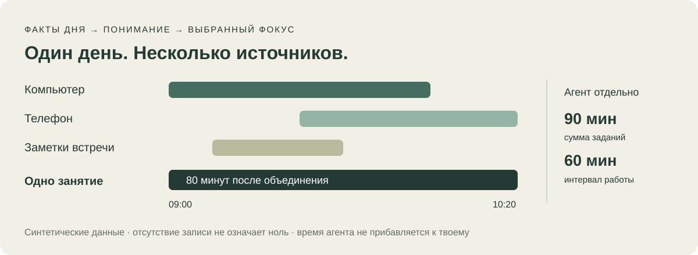

# Cross-device day review

**English** · [Русский](cross-device-day-review.ru.md)

**See what actually filled your day.** Compare intentions with observed activity, notice recurring themes and bring concrete evidence into reflection. Devices are sources for understanding the day; the purpose is to support your chosen focus.



The first public version reads a reviewed normalized JSON prepared from explicitly selected records. It does not automatically connect every device. The local CLI merges intervals; the skill helps normalize evidence and interpret the result with the person.

## Results

Activities sorted by known duration, unknown durations last; union human/device minutes without overlapping time counted twice; separate machine summed runtime and wall time; missing-source gaps; category links to your own intentions. Output files are `report.md` (Russian), `report.json` and `compact.json`.

A meeting and concurrent note-taking can share one episode ID after review. The CLI does not infer that relationship from window titles. Activity and source subtotals can overlap and must not be added to the union.

## Run the synthetic example

Python 3.10+ with IANA timezone data is required; no third-party Python packages, keys or accounts are needed. From the repository root:

```sh
python3 skills/cross-device-day-review/scripts/day_review.py \
  --config skills/cross-device-day-review/examples/config.json \
  --input skills/cross-device-day-review/examples/day.json \
  --output-dir /tmp/my-new-day-report
```

Choose an existing private parent and a new output directory. Existing outputs are refused. All example data is synthetic: union human/device time is **140 minutes**, machine runtime **90 minutes**, machine wall time **60 minutes**. Machine time is not added to human time. A missing tablet export and an untimed conversation keep the report partial.

Install the complete skill:

```sh
python3 scripts/install.py cross-device-day-review
```

For Claude Code use an explicit private destination:

```sh
python3 scripts/install.py cross-device-day-review --dest /absolute/private/project/.claude/skills
```

This copies files without collecting activity or starting services. The folder includes the [input contract](../../skills/cross-device-day-review/references/input.md), [adapter boundaries](../../skills/cross-device-day-review/references/adapters.md), [clean config](../../skills/cross-device-day-review/examples/config.json) and [JSON schema](../../skills/cross-device-day-review/references/input.schema.json).

To share a standalone archive, run `python3 scripts/build_cross_device_package.py --output /tmp/cross-device-new.zip` from the repository root. The builder includes only the explicit release allowlist, adds checksums and verifies the resulting ZIP. The output file must be new.

## Ask your agent

> Apply cross-device-day-review to my selected day records. Prepare private normalized JSON with provenance and reviewed corrections. Merge evidenced records of one episode and keep machine time separate. Run the CLI, help me interpret the report and ask only about meaningful gaps. Do not connect new sources or publish the report.

Apply human corrections **before analysis** by replacing superseded episode bounds, preserving provenance privately. Appending a correction alongside old records does not override them; the CLI performs a union, not truth arbitration.

## Continue with reflection

Use the reviewed report for [weekly review](weekly-review.md), [Evening Ten](evening-ten.md) or a conversation with a [personal assistant](personal-codex-assistant.md). These are separate requested steps. The CLI does not complete tasks, assess vitality, send to Telegram or import its JSON into another runtime.

## Limits

The executable adapter accepts normalized JSON. ActivityWatch, RescueTime, Computer History, calendar and agent-log integrations require explicitly prepared inputs; network connectors are not bundled. Coarse aggregates cannot become invented exact intervals. Keep approximate measurements in private provenance and use unknown-duration episodes where bounds are unavailable.

Only supplied records are visible. App activity is not proof of attention or understanding. `ready` means a selected export was processed, not continuous day coverage. Local tests and CI exercise the code and fixtures; they do not verify live services, Windows/WSL or completeness of anyone's day.

Keep personal labels, notes and reports outside public Git. Normalization is not guaranteed anonymization; review material before sharing with a person or model provider.

[Skill source](../../skills/cross-device-day-review/SKILL.md) · [Catalog](../catalog.md) · [System map](../system-map.md)
