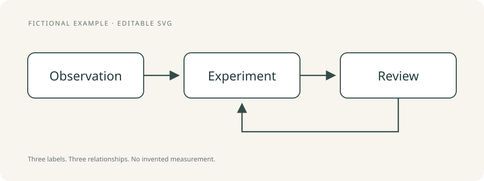

# Reconstruct SVG

**English** · [Русский](reconstruct-svg.ru.md)

**Make a useful diagram editable without changing its meaning.**

Bring a photographed sketch or a figure in a PDF back into a clean vector form. The skill keeps arrows, relationships, notation, and labels connected to the original, then compares the result visually.

| | What to expect |
| --- | --- |
| Input | A supplied image or a specified PDF page |
| Output | Standalone SVG plus a fidelity review |
| Useful for | Study diagrams, workshop sketches, editable learning material |
| Requirements | Image inspection; PDF renderer for PDF input; SVG renderer for visual QA; Python 3 for the included checker |
| Status | Installable instruction skill with a tested structural checker and original fictional example |

## Try it

> Use reconstruct-svg on this diagram. Preserve every label and arrow direction. Make the shapes editable and compare the rendered SVG with the original. List ambiguous details rather than inventing them.

[Open the example and review](../../examples/reconstruct-svg/) · [Read the skill](../../skills/reconstruct-svg/SKILL.md)

## Fidelity, then polish

Better spacing can help reading; changing a crossing into a connection changes the idea. The review checks these differences explicitly. A vector XML check cannot prove fidelity, so the skill reports visual inspection separately.

This is a vector reconstruction workflow. It does not include Prism or claim to reproduce measured data from a rough sketch.

[Back to Skills for Selfdev](../../README.md)

[Place in the personal system](../system-map.md)
