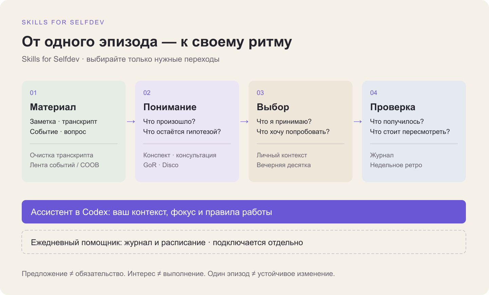

# Как скиллы складываются в личную систему

[English](system-map.md) · **Русский** · [Каталог](catalog.ru.md)

**Начни с одного полезного результата. Соединяй практики, когда появляется потребность продолжить.**

## Один пример вместо абстрактной схемы

После встречи осталась запись: «Перебил коллегу и начал защищать предложение, не уточнив вопрос». Это вымышленный пример, а не история автора.

1. **Сохранить материал.** «Очистка транскрипта» делает запись читаемой, сохраняя слова и неясности.
2. **Разобраться.** «Разбор реакции» помогает исследовать этот эпизод. Disco предлагает другой вход — через повторяющиеся реакции и метафору внутренних голосов. Если уже была консультация, её материал обрабатывает «Разбор своей сессии». Проходить все три не нужно.
3. **Отделить понимание от догадки.** «Я воспринимаю любой вопрос как отказ» пока может быть гипотезой. В личный контекст как принятое понимание попадает только то, что человек сам признал и решил использовать.
4. **Выбрать действие.** Человек принимает: «Сначала выясню смысл вопроса; он ещё не означает отказ» и выбирает на следующей встрече уточнить вопрос до ответа. Десятка может предложить такой ход, но выбор делает человек.
5. **Проверить.** После встречи в журнале появляется сообщение о том, что действительно произошло. Недельное ретро сопоставляет его с намерением. Один эпизод не доказывает устойчивого изменения.

[Полный вымышленный пример с передачей контекста →](../examples/system-walkthrough/example.ru.md)

## Два способа начать и необязательный ежедневный слой

| Сейчас нужно | Начни здесь | Что устанавливается |
| --- | --- | --- |
| Получить один результат по своему материалу | [Выбрать отдельную практику](catalog.ru.md) | Только выбранный скилл; можно работать в текущем разговоре |
| Сохранять фокус и возвращаться к результатам | [Личный ассистент в Codex](skills/personal-codex-assistant.ru.md) | Чистый личный контекст и согласованные правила в выбранной частной папке |
| Добавить ежедневные сообщения и журнал | [Ежедневный помощник](skills/personal-daily-assistant.ru.md) | Отдельная программа OpenClaw/Telegram со своими аккаунтами и настройкой расписания |

Начать с ручных заметок достаточно. Computer History, Telegram, Личный кабинет и другие сервисы подключаются по отдельности, когда они нужны.

## Роль каждого модуля

| Этап | Инструменты | Что передаётся дальше |
| --- | --- | --- |
| Собрать исходный материал | [Очистка транскрипта](skills/clean-transcript.ru.md), [лента событий](skills/life-events.ru.md), [СООВ](integrations/soov.ru.md) | Проверенный текст или событие с источником и неопределённостями |
| Учиться и разбираться | [Конспект](skills/learning-notes.ru.md), [интервью эксперта](skills/analyze-expert-interview.ru.md), [разбор консультации](skills/reflect-on-session.ru.md), [GoR](skills/reflect-on-reaction.ru.md), [Disco](skills/disco-mirror.ru.md) | Объяснение, рабочая гипотеза или понимание с обозначенным статусом |
| Удерживать выбранный фокус | [Ассистент в Codex](skills/personal-codex-assistant.ru.md) | Собственный контекст, принятое понимание и выбранный результат |
| Увидеть дополнительные возможности | [Вечерняя десятка](skills/evening-ten.ru.md) | Предложения; заинтересовавшийся пункт ещё не задача |
| Сохранить опыт и пересмотреть выбор | [Ежедневный помощник](skills/personal-daily-assistant.ru.md), [недельное ретро](skills/weekly-review.ru.md) | Явные отметки человека, свидетельства результата и поправки |
| Сделать материал удобным | [SVG](skills/reconstruct-svg.ru.md), [Личный кабинет](integrations/lk-sendpulse.ru.md), [Longevity](skills/longevity-intake.ru.md) | Редактируемая схема, интерфейс работы или ввод для отдельной условной модели |

Это карта возможных переходов, а не обязательный конвейер. Разбор лекции может закончиться хорошим конспектом. Не каждое понимание должно стать задачей, а не каждая запись требует анализа.

## Как передавать контекст

Между скиллами передавай небольшой проверенный фрагмент: источник и дату, событие, статус утверждения, принятое понимание, выбранное действие и известный результат. Сохраняй ссылку на исходник вместо переноса всей личной истории. Есть [вымышленный JSON-пример](../examples/system-walkthrough/handoff.json); это формат для чтения человеком и агентом, **не API импорта ежедневного помощника**.

- Наблюдение, слова человека и интерпретация модели остаются различимыми.
- Предложение → интерес → решение → попытка → результат — разные статусы. Между ними нет автоматического перехода.
- Изменять личный контекст можно в рамках порученной настройки или явно выбранного сохранения. Ответ модели сам по себе не становится убеждением человека.
- Отсутствие записи означает пробел. Нельзя восстановить офлайн-жизнь из одного компьютерного журнала.

Скиллы не синхронизируют файлы друг с другом автоматически. Передачу делает человек или агент в рамках порученной работы. Для данных ежедневного помощника действуют его собственные проверяемые команды.

## Что уже доступно

В коллекции 13 скиллов. Ассистент в Codex, Десятка, недельное ретро и GoR доступны по запросу. Ежедневный помощник включает отдельный локальный runtime; перечень реализованных сценариев и условия включения находятся [на его странице](skills/personal-daily-assistant.ru.md). Разговорные скиллы не превращаются автоматически в Telegram-сценарии.

Личный кабинет и СООВ поддерживаются в отдельных репозиториях. Единого входа, общей базы и автоматической синхронизации всех приложений в этой коллекции нет. Prism остаётся внешним инструментом.

[Начать установку](getting-started.ru.md) · [Данные и приватность](../PRIVACY.ru.md) · [На главную](../README.ru.md)
